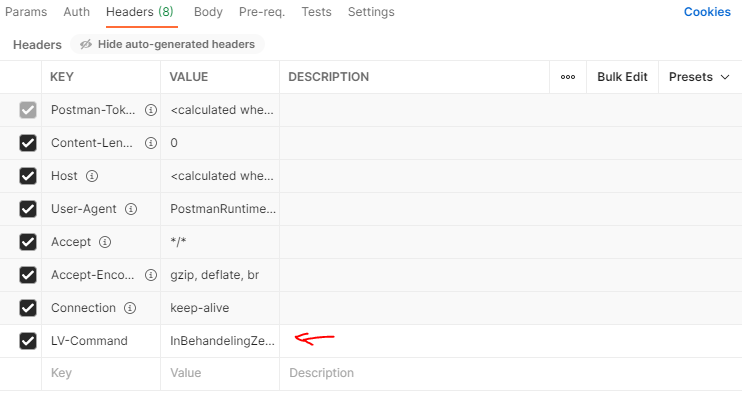
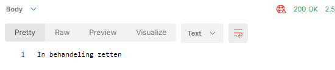

# POC - Differentiate ASP.NET Core WebApi methods by header

## Copy the following HttpHeaderAttribute

```c#
public sealed class HttpHeaderAttribute : Attribute, IActionConstraint
	{
		public string Header { get; set; }
		public string Value { get; set; }

		public HttpHeaderAttribute(string header, string value)
		{
			Header = header;
			Value = value;
		}

		public bool Accept(ActionConstraintContext context)
		{
			if (context.RouteContext.HttpContext.Request.Headers.TryGetValue(Header, out var value))
			{
				return value[0] == Value;
			}

			return false;
		}

		public int Order => 0;
	}
```

Reference: https://stackoverflow.com/questions/39302121/header-based-routing-in-asp-net-core

This can of course be made more specific (fixed header name).

## Add the attribute to the method

Use PATCH as verb, because in this scenario, you're likely not going to update a whole resource (and it makes no sense to do a PUT on another resource on the same end point).

```c#
[ApiController]
[Route("[controller]")]
public class AanvraagController : Controller
{
	[HttpPatch, HttpHeader("LV-Command", "Indienen")]
	public IActionResult Indienen()
	{
		return Ok("Indienen");
	}

	[HttpPatch, HttpHeader("LV-Command", "InBehandelingZetten")]
	public IActionResult InBehandelingZetten()
	{
		return Ok("InBehandelingZetten");
	}
}
```

## How to test

1. Run the application

2. Open Postman

3. Choose PATCH and enter your endpoint:

   

4. Add a header:

   

5. Click "Send"

   